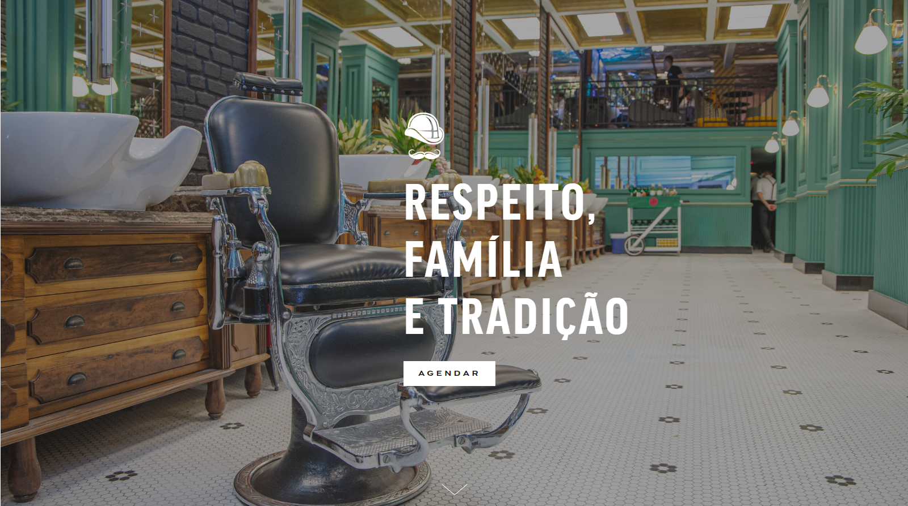

<!DOCTYPE html>
<html lang="pt-br">
<head>   	
    <meta charset="UTF-8">
    <title>Barbearia Alura</title>
    <link rel="stylesheet" href="style.css">
    
</head>

<body>
    
    

        <h1>Sobre a Barbearia Alura</h1>

        
Localizada no coracao da cidade, a <strong>Barbearia Alura</strong> traz para o mercado o que ha de melhor para o seu cabelo e barba. Fundada em 2019, a Barbearia Alura ja e destaque na cidade e conquista novos clientes a cada dia.

        
<em>Nossa missao e: <strong>"Proporcionar autoestima e qualidade de vida aos clientes"</strong>.</em>

        
Oferecemos profissionais experientes e antenados as mudancas no mundo da moda. O atendimento possui padrao de excelencia e agilidade, garantindo qualidade e satisfacao dos nossos clientes.

    

    

        <h2>Beneficios</h2>
        
        <ul>
            <li>Atendimento aos Clientes</li>
            <li>Espaco diferenciado</li>
            <li>Localizacao</li>
            <li>Profissionais Qualificados</li>
        </ul>
    

</body>
</html>
